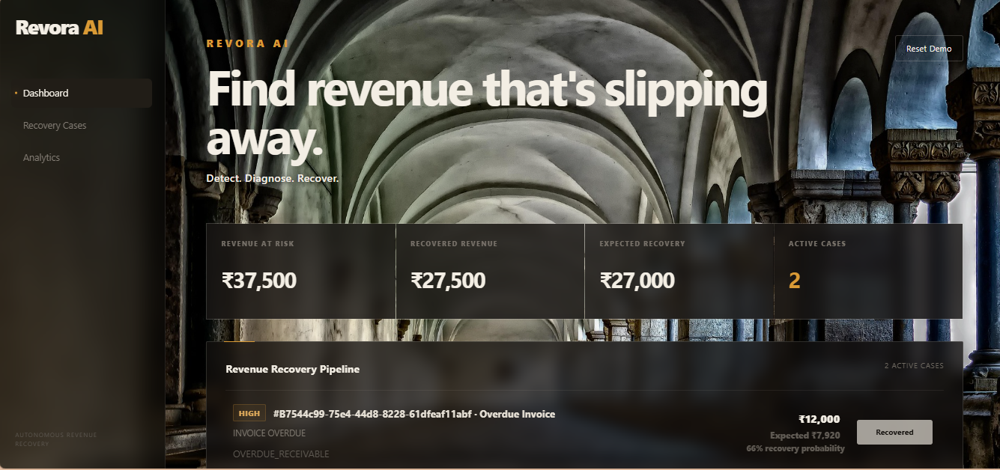

# ⚡ Revora AI — Revenue Recovery

> **Detect. Diagnose. Recover. Measure.**

<h2>🖥️ Revora AI Dashboard</h2>

<p align="center">
  
</p>

<p align="center">
  <b>Detect. Diagnose. Recover. Measure.</b>
</p>

Revora AI is an autonomous revenue-recovery platform that identifies failed and at-risk revenue, diagnoses the underlying cause, selects an appropriate recovery intervention, executes the recovery workflow, and measures the resulting revenue impact.

Built for the **Razorpay Buildathon 2026 — AI Revenue Recovery Track**.

---

## 🎯 The Problem

Payment failures are not simply "failed payments".

A failed transaction can happen because of:

- insufficient funds
- temporary bank or gateway failures
- expired payment instruments
- recurring-payment failures
- abandoned checkout attempts
- overdue invoices
- failed subscription renewals
- temporary authorization issues

Traditional recovery systems often respond with the same action:

> **Retry → Wait → Retry → Wait → Give up**

This creates three problems:

1. **Recoverable revenue is lost**
2. **Customers receive unnecessary or poorly timed communication**
3. **Businesses have limited visibility into how much revenue is actually being recovered**

Revora AI treats every recovery case as a decision problem.

---

# 💡 My Approach

Revora AI follows a closed-loop recovery lifecycle:

```text
                  REVENUE EVENT
                       │
                       ▼
              ┌─────────────────┐
              │     DETECT      │
              │ Identify risk   │
              │ & failed cases  │
              └────────┬────────┘
                       │
                       ▼
              ┌─────────────────┐
              │    DIAGNOSE     │
              │ Understand why  │
              │ revenue is at   │
              │ risk            │
              └────────┬────────┘
                       │
                       ▼
              ┌─────────────────┐
              │     DECIDE      │
              │ Select the most │
              │ suitable        │
              │ intervention    │
              └────────┬────────┘
                       │
                       ▼
              ┌─────────────────┐
              │     RECOVER     │
              │ Execute retry / │
              │ outreach /      │
              │ recovery action │
              └────────┬────────┘
                       │
                       ▼
              ┌─────────────────┐
              │     MEASURE     │
              │ Track recovered │
              │ revenue and     │
              │ outcomes        │
              └────────┬────────┘
                       │
                       └──────────────► Learning / Analytics

🧠 Core Architecture

                         ┌──────────────────────┐
                         │ Revenue Risk / Event │
                         └──────────┬───────────┘
                                    │
                                    ▼
                         ┌──────────────────────┐
                         │  Revenue Risk Engine │
                         │  Detect & Prioritize │
                         └──────────┬───────────┘
                                    │
                                    ▼
                         ┌──────────────────────┐
                         │ Diagnosis / RCA      │
                         │ Why did it fail?     │
                         └──────────┬───────────┘
                                    │
                                    ▼
                         ┌──────────────────────┐
                         │ Recovery Decision    │
                         │ Intervention Engine  │
                         └──────────┬───────────┘
                                    │
                       ┌────────────┴────────────┐
                       │                         │
                       ▼                         ▼
              ┌─────────────────┐       ┌─────────────────┐
              │ Automated       │       │ Human / Manual  │
              │ Recovery        │       │ Intervention    │
              └────────┬────────┘       └────────┬────────┘
                       │                         │
                       └────────────┬────────────┘
                                    ▼
                         ┌──────────────────────┐
                         │ Outcome Tracking     │
                         │ Recovered Revenue    │
                         │ Recovery Rate        │
                         └──────────┬───────────┘
                                    ▼
                         ┌──────────────────────┐
                         │ Analytics & Insights │
                         └──────────────────────┘

🔥 What Makes Revora AI Different?
1. From Payment Recovery to Revenue Recovery

Revora AI is designed around the money at risk, not simply the payment event.

Every case can be evaluated in terms of:

Amount at risk
Recovery probability
Expected recovery
Selected intervention
Intervention outcome
Actual recovered amount

This lets operators answer the business question:

"How much revenue can we save, and how much have we actually saved?"

2. Closed-Loop Recovery

Most recovery engines stop after selecting or executing an action.

Revora AI continues through the outcome:

Risk
 ↓
Diagnosis
 ↓
Intervention
 ↓
Execution
 ↓
Outcome
 ↓
Recovered Revenue
 ↓
Analytics

This creates a measurable feedback loop between operational decisions and financial outcomes.

3. Case-Level Intelligence

Every recovery case can be inspected individually.

Instead of presenting only aggregate numbers, Revora AI allows operators to understand:

What happened?
Why is revenue at risk?
What intervention was selected?
What is the current status?
How much revenue is at risk?
How much has been recovered?

This makes the system suitable for both automation and human operations teams.

4. Portfolio-Level Revenue Visibility

The dashboard provides a financial view of the recovery pipeline.

Key metrics
Total Revenue at Risk
Expected Recovery
Recovered Revenue
Recovery Rate
Active Recovery Cases
Intervention Outcomes

Instead of looking at thousands of failed transactions individually, operators get a portfolio-level view of recovery performance.

🏗️ Technology Stack

Frontend
React
Vite
JavaScript
CSS
Responsive dashboard UI
Backend
Python
FastAPI
SQLAlchemy
SQLite
AI / Decision Layer
Revenue-risk analysis
Failure diagnosis
Recovery decision logic
Intervention selection
Outcome evaluation
Integrations
Payment/recovery workflow integrations
Email communication
Payment gateway integration layer


📁 Project Structure
Revora-AI/
│
├── backend/
│   ├── app/
│   │   ├── api/
│   │   ├── models/
│   │   ├── services/
│   │   ├── agents/
│   │   └── main.py
│   │
│   └── ...
│
├── frontend/
│   ├── src/
│   │   ├── components/
│   │   ├── pages/
│   │   ├── services/
│   │   └── styles/
│   │
│   └── ...
│
├── scripts/
│   └── seed_database.py
│
├── .env.example
├── docker-compose.yml
└── README.md


🔄 Recovery Lifecycle

1. Detect

Identify revenue-risk events and failed transactions.

2. Diagnose

Determine the underlying reason and recovery context.

3. Decide

Evaluate the available recovery interventions.

4. Execute

Trigger the appropriate recovery workflow.

5. Measure

Track whether the intervention generated a successful recovery.

6. Analyze

Aggregate outcomes into recovery analytics and business KPIs.

📊 Dashboard

Revora AI provides an operational command center for revenue recovery.

Overview
┌─────────────────────────────────────────────────────────────┐
│ REVORA AI                                                   │
│                                                             │
│ Revenue At Risk     Expected Recovery     Recovered Revenue │
│     ₹XX,XXX             ₹XX,XXX               ₹XX,XXX       │
│                                                             │
├─────────────────────────────────────────────────────────────┤
│ Active Recovery Cases                                       │
│                                                             │
│ Case       Amount       Risk       Intervention    Status   │
│ #001       ₹5,000       High       Retry           Active   │
│ #002       ₹2,400       Med        Payment Link    Recovered│
│ #003       ₹8,200       High       Outreach        Pending  │
└─────────────────────────────────────────────────────────────┘

The interface is designed to make the financial impact of every recovery decision visible.

🧩 Recovery Scenarios

Revora AI is designed to support multiple revenue-loss scenarios, including:

Failed payments
Recurring payment failures
Subscription payment failures
Abandoned checkout recovery
Overdue invoices
Mandate-related recovery
Payment retry workflows
🛡️ Safe Automation

Revenue recovery should not mean blindly retrying everything.

Revora AI separates:

Detection
    ↓
Diagnosis
    ↓
Decision
    ↓
Execution

This allows recovery logic and operational controls to be extended independently.

High-risk or exceptional cases can be surfaced for operational review rather than forcing every case through the same automated path.

📈 Business Impact

Revora AI focuses on metrics that matter to a revenue team:

Metric	Meaning
Revenue at Risk	Money potentially lost
Expected Recovery	Estimated recoverable value
Recovered Revenue	Revenue actually recovered
Recovery Rate	Recovery effectiveness
Active Cases	Current recovery workload
Intervention Outcome	Result of the selected action

The goal is simple:

Turn failed transactions into measurable recovered revenue.

🆚 Why Revora AI?

Revenue recovery projects often focus primarily on the intelligence behind the next retry.

Revora AI focuses on the complete operational lifecycle:

                 ┌────────────────────────┐
                 │ Revenue At Risk         │
                 └───────────┬────────────┘
                             ↓
                 ┌────────────────────────┐
                 │ AI Diagnosis           │
                 └───────────┬────────────┘
                             ↓
                 ┌────────────────────────┐
                 │ Recovery Decision       │
                 └───────────┬────────────┘
                             ↓
                 ┌────────────────────────┐
                 │ Intervention            │
                 └───────────┬────────────┘
                             ↓
                 ┌────────────────────────┐
                 │ Revenue Recovered      │
                 └───────────┬────────────┘
                             ↓
                 ┌────────────────────────┐
                 │ Analytics & Learning   │
                 └────────────────────────┘
🚀 Running Locally
Backend
cd ai-revenue-recovery

python -m venv .venv

# Windows
.venv\Scripts\activate

pip install -r backend/requirements.txt

$env:PYTHONPATH="$PWD/backend"

python scripts/seed_database.py

cd backend

uvicorn app.main:app --reload --port 8000

Backend:

http://127.0.0.1:8000

API documentation:

http://127.0.0.1:8000/docs
Frontend
cd frontend

npm install

npm run dev

Frontend:

http://localhost:5173
🎬 Demo Flow

A recommended demo:

1. Open Revora AI Dashboard
             ↓
2. Show Revenue At Risk
             ↓
3. Open Recovery Cases
             ↓
4. Select a failed-payment case
             ↓
5. Show diagnosis
             ↓
6. Show selected intervention
             ↓
7. Execute recovery
             ↓
8. Show outcome
             ↓
9. Return to Dashboard
             ↓
10. Show recovered revenue

The key story:

"We don't just detect failed payments. We turn them into measurable revenue recovery."

🔮 Future Roadmap
Production LLM providers
Real-time Razorpay webhook ingestion
More payment gateway integrations
WhatsApp/SMS orchestration
Advanced ML recovery prediction
Adaptive intervention optimization
Merchant-specific recovery policies
Production-grade event streaming
Long-term recovery learning
A/B testing of recovery strategies
